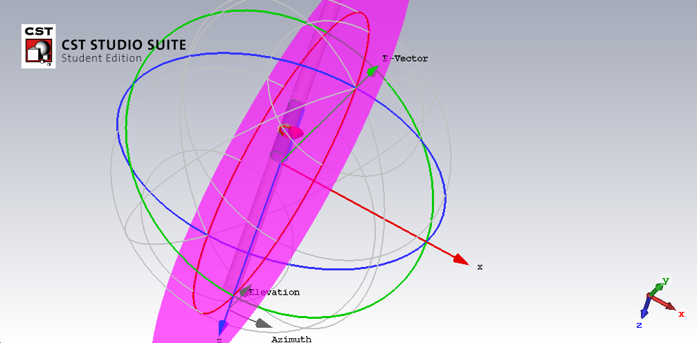
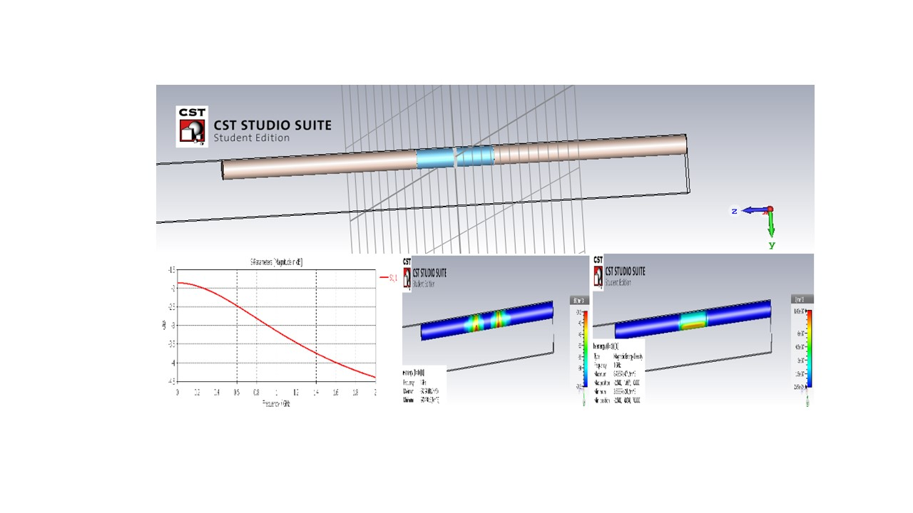
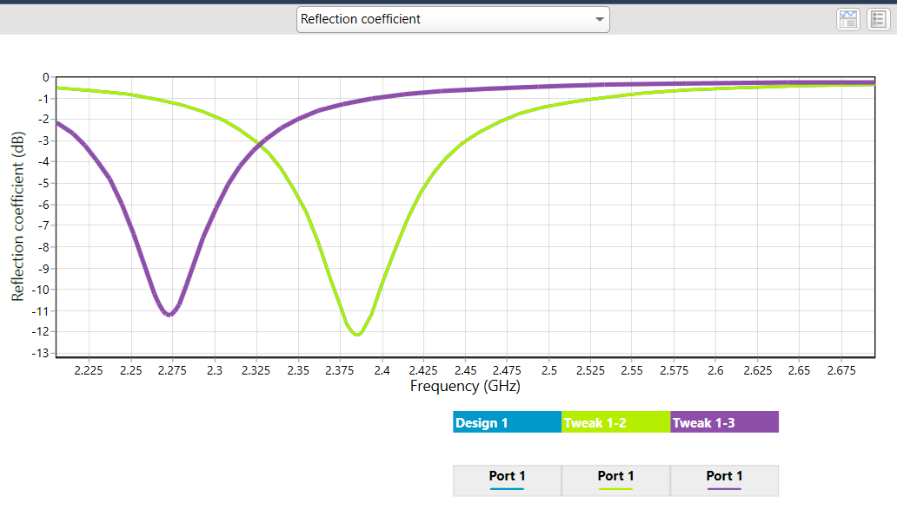

# Antenna Design

The project provides an introduction to antenna design. Confidential information is not displayed. 
Please download the executable in https://github.com/alpaddesai/AntennaDesign/releases for details.
All images are either custom by Alpa D Desai.

## Antenna Design 

## Patch Antenna

## Dipole Antenna

## Circular Patch Antenna
### Antenna Magus

Addiitional reference: https://github.com/alpaddesai/SmartGridDesignIdea
