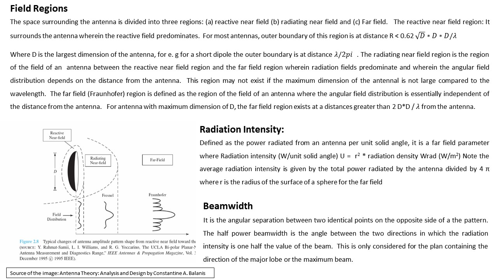

# Antenna Design

The project provides an introduction to antenna design. Confidential information is not displayed. 
All images are either custom by Alpa D Desai.

## Antenna Design 

## Patch Antenna

## Dipole Antenna

## Circular Patch Antenna
### Antenna Magus

## 5G Antenna Design

## Energy Harvesting

## RF Fundamentals

Addiitional reference: https://github.com/alpaddesai/ArchitecturalProductDesign
